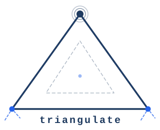

# triangulate

<p align="center">
  
</p>

Triangulate finds your project's root directory by walking upward from the
current directory until it locates a marker file. This allows you to run commands
relative to a project root from anywhere in that project's directory tree.

## Contents

- [Installation](#installation)
  - [Homebrew](#homebrew)
  - [Linux](#linux)
- [Examples](#examples)
  - [Basic usage](#basic-usage)
  - [Specifying a custom marker file](#specifying-a-custom-marker-file)
  - [Limiting search depth](#limiting-search-depth)
- [Setting an environment variable](#setting-an-environment-variable)
- [Installing the shell extension](#installing-the-shell-extension)
- [Managing configuration](#managing-configuration)
- [Environment variables](#environment-variables)
- [Using the SDK](#using-the-sdk)
- [License](#license)

## Installation

### Homebrew

```shell
brew tap programmablemike/homebrew-tap
brew install triangulate
```

### Linux

Download the binary, `.deb`, or `.rpm` package for your architecture from the
[releases page](https://github.com/programmablemike/triangulate/releases).

## Examples

Given this directory structure:

```text
/home/mike/myproject/
  TRIANGULATE          ← marker file
  go.mod
  main.go
  lib/
    logging/
      logging.go
    cmd/
      cmd.go
```

### Basic usage

```shell
# From anywhere inside the project, print the project root
$ cd /home/mike/myproject/lib/logging
$ triangulate
/home/mike/myproject

# Pass a path explicitly instead of using the current directory
$ triangulate /home/mike/myproject/lib/logging
/home/mike/myproject

# Use the result to run a build from the project root
$ cd $(triangulate) && go build -o ./output/myproject
```

### Specifying a custom marker file

```shell
# Use a different marker file (e.g. go.mod, .git, BUILD.root)
$ triangulate --marker go.mod
/home/mike/myproject

# Search for multiple marker files; the first ancestor containing any of them wins
$ triangulate --marker "go.mod,WORKSPACE"
/home/mike/myproject
```

### Limiting search depth

```shell
# Only search up to 3 directory levels above the start directory
$ triangulate --max-depth 3
/home/mike/myproject

# Search only the current directory (depth 0)
$ triangulate --max-depth 0
triangulate: marker not found
```

## Setting an environment variable

The shell integration is the most powerful way to use Triangulate. After
installing it (see [Installing the shell extension](#installing-the-shell-extension)),
`$TRIANGULATE_ROOT` is automatically kept in sync as you `cd` between
directories.

You can rename the variable with `--env-var-name` or `TRIANGULATE_ENV_VAR_NAME`:

```shell
# Rename the exported variable from TRIANGULATE_ROOT to PROJECT_ROOT
$ export TRIANGULATE_ENV_VAR_NAME=PROJECT_ROOT
# Now the shell hook will maintain $PROJECT_ROOT automatically as you navigate
$ cd /home/mike/myproject/lib/logging
$ echo "$PROJECT_ROOT"
/home/mike/myproject
```

## Installing the shell extension

Triangulate provides a shell hook for `bash` or `zsh` that re-runs `triangulate`
whenever `$PWD` changes and keeps `$TRIANGULATE_ROOT` up-to-date automatically.

```shell
# Append the snippet to your shell config (run once)
$ triangulate shell zsh >> ~/.zshrc
$ triangulate shell bash >> ~/.bashrc

# Or source it inline without modifying your config
$ eval "$(triangulate shell zsh)"
```

After sourcing, `$TRIANGULATE_ROOT` is always set to the detected project root
of the current directory, or unset when no marker is found.

## Managing configuration

Use `triangulate config` to read and write the persistent config file
(`~/.triangulate` by default).

```shell
# View all current settings
$ triangulate config list

# Set the default marker files (comma-separated)
$ triangulate config set marker_files "go.mod,WORKSPACE"

# Set a custom env var name so the shell hook uses it automatically
$ triangulate config set env_var_name PROJECT_ROOT

# Limit how deep triangulate searches by default
$ triangulate config set max_depth 10

# Disable case-sensitive marker matching
$ triangulate config set case_sensitive false

# Read back a single value
$ triangulate config get marker_files
go.mod,WORKSPACE

# Validate the config file format
$ triangulate config validate
valid
```

The full set of supported config keys:

| Key               | Type             | Description                                        |
|-------------------|------------------|----------------------------------------------------|
| `marker_files`    | comma-separated  | Files whose presence marks a project root          |
| `start_directory` | path             | Default start directory (overrides cwd)            |
| `case_sensitive`  | bool             | Whether marker matching is case-sensitive          |
| `max_depth`       | int              | Max directory levels to search (0 = current only)  |
| `env_var_name`    | string           | Env var name the shell hook exports                |

Example config file (`~/.triangulate`):

```json
{
  "marker_files": ["go.mod", "WORKSPACE"],
  "case_sensitive": true,
  "max_depth": 10,
  "env_var_name": "PROJECT_ROOT"
}
```

## Environment variables

All settings can also be provided via environment variables. They take precedence
over the config file but are overridden by explicit CLI flags.

| Variable                      | Description                                  |
|-------------------------------|----------------------------------------------|
| `TRIANGULATE_MARKER_FILE`     | Comma-separated list of marker file names    |
| `TRIANGULATE_START_DIRECTORY` | Default start directory                      |
| `TRIANGULATE_CASE_SENSITIVE`  | Case sensitivity (`true`/`false`)            |
| `TRIANGULATE_MAX_DEPTH`       | Maximum search depth                         |
| `TRIANGULATE_ENV_VAR_NAME`    | Name of the env var the shell hook exports   |

## Using the SDK

If you need triangulate functionality inside a Go project, import the package
directly:

```shell
go get github.com/programmablemike/triangulate/pkg/triangulate
```

```go
package main

import (
    "fmt"
    "log"

    "github.com/programmablemike/triangulate/pkg/triangulate"
)

func main() {
    // ResolveOptions merges defaults, config file, env vars, and explicit overrides.
    // Precedence: defaults < config file < env vars < Options fields.
    opts, err := triangulate.ResolveOptions(triangulate.Options{
        // Override the marker file to use go.mod instead of TRIANGULATE
        MarkerFiles: []string{"go.mod"},
        // Limit the upward search to 5 levels
        MaxDepth:    5,
        MaxDepthSet: true,
    })
    if err != nil {
        log.Fatal(err)
    }

    root, err := triangulate.FindRoot(opts)
    if err != nil {
        // triangulate.ErrNotFound means no marker was found within the depth limit
        log.Fatal(err)
    }

    fmt.Println("project root:", root)
}
```

Pass an empty `triangulate.Options{}` to use the config file and environment
variables alone with no code-level overrides.

## License

This project is licensed under the MIT License. See [LICENSE](./LICENSE) for details.
